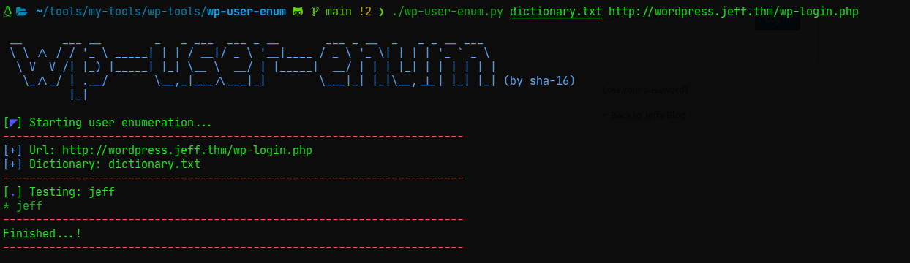

# WP-USER-ENUM
Esta es una utilidad que he creado con el fin único de enumerar usuarios de plataformas WordPress a través del panel de login que estos traen.
Para ello aplico fuerza bruta con un diccionario (que puede ser cualquiera; todo a gusto de quien la utilice).

## Instalación y uso ⚡
```bash
$ git clone https://github.com/sha-16/wp-user-enum.git
$ cd wp-user-enume/
$ chmod +x wp-user-enum.py
$ ./wp-user-enum.py
```

## Ejecución 💥


**Nota:** si detectas errores en el código o ejecución del script, por favor házmelos saber ❤. 
